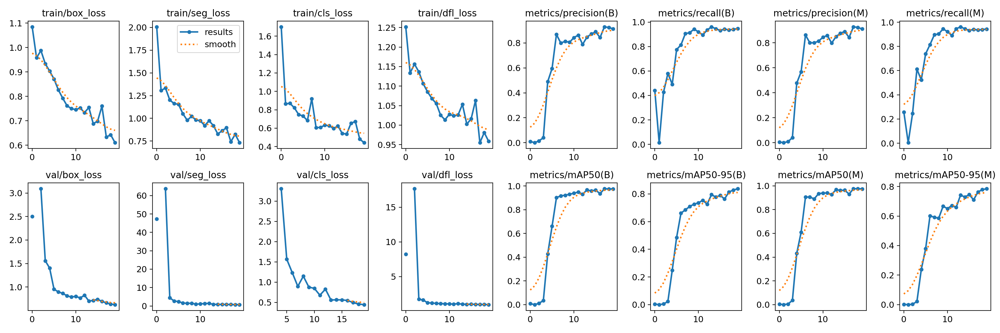

# Solar Panel Segmentation from satellite and aerial imagery

## Description
This project aims to segment solar panels from satellite and aerial imagery using YoloV8. The dataset used for training is the [Multi-resolution dataset for photovoltaic panel segmentation from satellite and aerial imagery](https://zenodo.org/record/5171712/). Only the PV01.zip file is used for training. The dataset contains 645 images of size 256*256. The dataset is split into 545 images for training and 100 images for validation. 

The dataset contained images and their corresponding masks. The masks were converted to labels and polygons using the mask_to_poly.py file.

## Dataset
The dataset is available at [Multi-resolution dataset for photovoltaic panel segmentation from satellite and aerial imagery](https://zenodo.org/record/5171712/). The dataset contains 645 images of size 256*256. The dataset is split into 545 images for training and 100 images for validation.

## Training
The model is trained for 20 epochs. The training metrics are as follows:


## Inference
`prediction.py` can be used for inference on images. Use the following command to run inference on an image:
```
python prediction.py --image [Image path] --model [Model path] -c 0.5
```
```
OR 

```
!yolo task=segment mode=predict model=[Model path] conf=0.5 source=[Image path] save=true
```